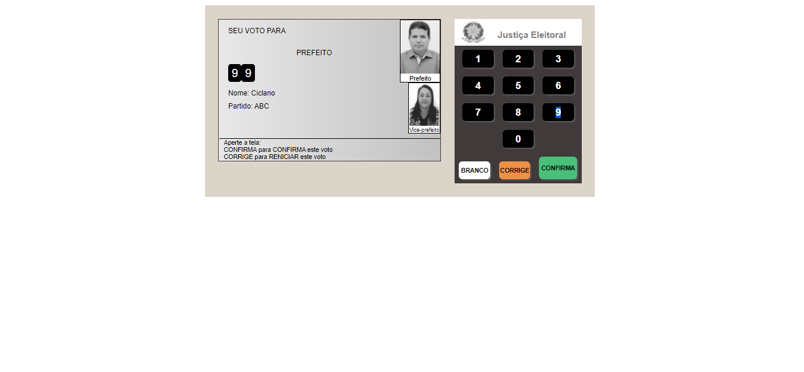
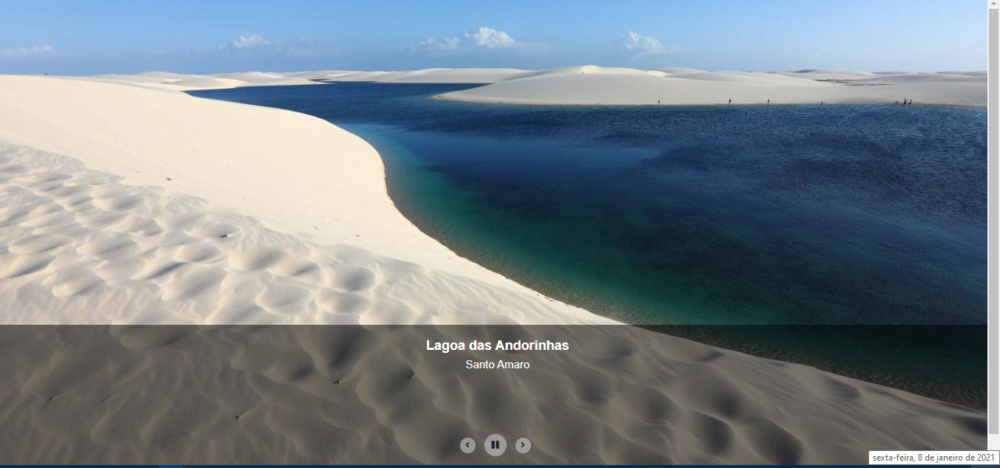
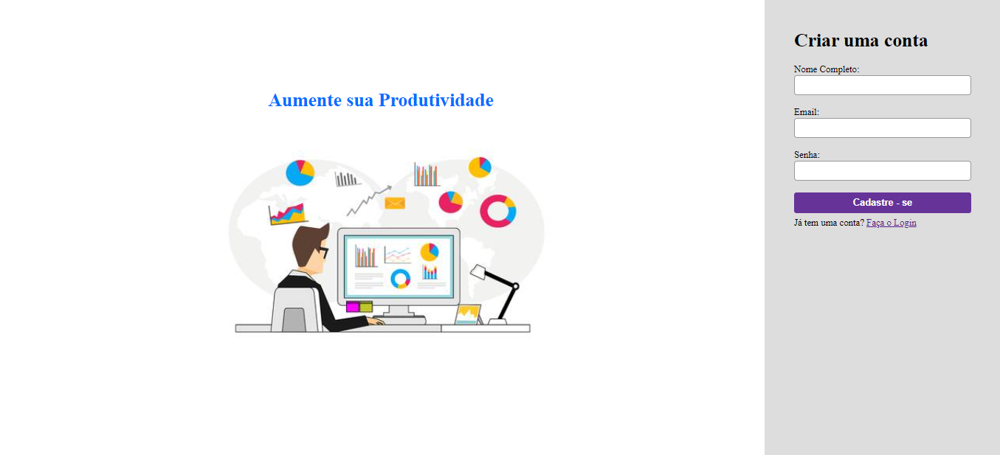

# Live em Javascript

Três projetos em Javascript puro feitos durante uma live com o professor Bonieky Lacerda da B7Web.

## Urna Eletrônica

Um simulador da urna eletrônica brasileira. O script recebe um arquivo JSON contendo as etapas da eleição, bem como os candidatos disponíveis para o pleito.

## SlideShow

Um slider de fotos com botões para avançar, voltar e pausar a apresentação.

<!-- ## :heavy_check_mark: :iphone: Resultado Web

<h1 align="center">
    
    
    
</h1> -->

## Validação de Formulário

Um formulário que, ao ser enviado, é validado pelo próprio navegador. São mostradas mensagens de erro para o usuário.

## :memo: License

Esse projeto está sob a licença MIT. Veja o arquivo [LICENSE](LICENSE.md) para mais detalhes.

---

<h4 align="center">
    Feito com 💜 by <a href="https://www.linkedin.com/in/rafael-r-dos-santos-b889311ba/" target="_blank">Rafael Rufino</a>
</h4>
